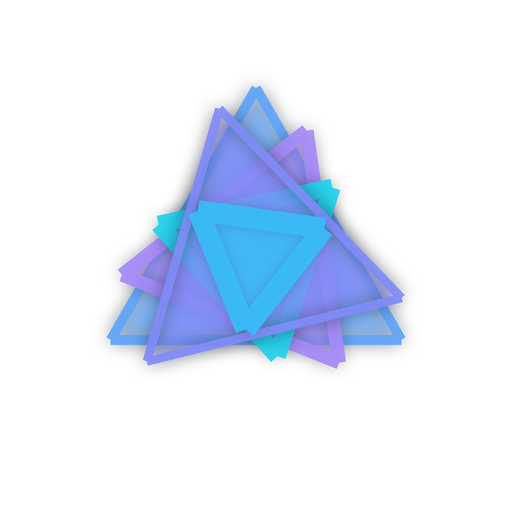

# Unika

**Unika** is a desktop AI agent built specifically for Unity game development. It runs locally on your machine alongside the Unity Editor, giving you a powerful copilot that can read and write project files, execute shell commands, search the web, compile C# code, and manage your game design and technical documents — all from a single chat interface.

---

## Features

- **Full file access** — read, write, and edit any file in your Unity project
- **Live Unity integration** — communicate with the Unity Editor in real time via a native bridge
- **Subagent pipeline** — specialized agents for coding, planning, reviewing, searching, and deep reasoning
- **Document management** — maintain GDD, TDD, Game Context, Memory, and Session Log as Markdown files
- **Kanban board** — drag-and-drop task board stored per-project, optionally exposed to the agent
- **Mermaid flowcharts** — render, zoom, pan, and export diagrams directly in chat and documents
- **Rich chat UI** — animated token streaming with blur-in chunks, syntax highlighting, LaTeX, Unity asset chips
- **Usage meter** — real-time DeepSeek API balance and per-agent cost breakdown
- **System prompt editor** — full control over the agent's instructions from the settings panel
- **Context toggles** — per-project toggles to include/exclude GDD, TDD, memory, logs, and board in every prompt
- **Portable build** — ships as a self-contained folder; no Python or Node required on the end-user machine

---

## Tech Stack

| Layer | Technology |
|---|---|
| Desktop shell | Electron 31 |
| Frontend | React 18 + TypeScript + Vite (electron-vite) |
| Styling | Tailwind CSS + Cascadia Code |
| AI model | DeepSeek V3 (`deepseek-chat`) + R1 (`deepseek-reasoner`) |
| Backend | Python 3.11 · FastAPI · WebSockets |
| Search | Tavily API |
| Packaging | PyInstaller (backend) + electron-builder (app) |

---

## Project Structure

```
Unika/
├── backend/                  # Python FastAPI server + agent logic
│   ├── agent/
│   │   ├── core.py           # Main agent loop, subagent dispatch, stop propagation
│   │   ├── models.py         # DeepSeek streaming, token usage tracking
│   │   └── prompts.py        # System prompt builder, file override support
│   ├── commands/             # Tool registry (FILE_*, UNITY_*, SEARCH, ASK, …)
│   ├── projects/             # Project + conversation persistence
│   ├── rag/                  # Retrieval-augmented generation (code indexing)
│   ├── unity/                # Unity Editor bridge (TCP socket)
│   └── server.py             # FastAPI app, WebSocket hub, REST endpoints
├── frontend/
│   ├── electron/             # Electron main process + preload
│   ├── public/               # Static assets (icons, sounds, logo)
│   ├── scripts/              # export_logo.py — regenerate logo & icons
│   └── src/
│       ├── components/       # React UI components
│       │   ├── Chat/         # MessageList, MessageInput, streaming, blur-in
│       │   ├── DocEditor/    # Markdown editor + preview + TOC outline + Kanban
│       │   ├── Kanban/       # Drag-and-drop board
│       │   ├── Settings/     # API keys, sounds, system prompt editor
│       │   └── Sidebar/      # Project list, channel switcher
│       ├── hooks/            # useWebSocket, useBlurChunks, …
│       └── stores/           # Zustand stores (settings, usage, …)
├── unity-plugin/             # C# Unity Editor plugin (TCP bridge)
├── compilar.bat              # One-click build script → Desktop/Unika App/
├── start_dev.bat             # Launch backend + frontend in dev mode
└── .env                      # Local API keys (gitignored, dev only)
```

---

## Getting Started

### Prerequisites

- **Python 3.11+** (for running the backend in dev mode or building)
- **Node.js 18+** and **npm**
- A **DeepSeek API key** ([platform.deepseek.com](https://platform.deepseek.com))
- *(Optional)* A **Tavily API key** for web search ([app.tavily.com](https://app.tavily.com))

### Development

1. **Clone the repository**

   ```bash
   git clone https://github.com/YOUR_USERNAME/Unika.git
   cd Unika
   ```

2. **Set up API keys**

   ```bash
   cp .env.example .env
   # Edit .env and add your DEEPSEEK_API_KEY (and optionally TAVILY_API_KEY)
   ```

3. **Install backend dependencies**

   ```bash
   pip install -r requirements.txt
   ```

4. **Install frontend dependencies**

   ```bash
   cd frontend && npm install
   ```

5. **Start in dev mode**

   ```bash
   # From the project root:
   start_dev.bat
   # or manually:
   # Terminal 1: python backend/server.py
   # Terminal 2: cd frontend && npm run dev
   ```

### Production Build

Run the one-click build script from the project root:

```bash
compilar.bat
```

This will:
1. Compile the Python backend with **PyInstaller** → `backend/dist/unika-agent/`
2. Build the frontend with **electron-vite**
3. Package everything with **electron-builder**
4. Copy the final app to **`Desktop\Unika App\`**

The resulting folder is fully portable — no Python or Node installation required.

---

## Unity Integration

Install the Unity plugin by copying `unity-plugin/` into your project's `Assets/` folder. The plugin opens a TCP socket (port 6400 by default) that the backend communicates with to:

- Trigger and read compile logs
- Query the asset database
- Execute Editor operations at runtime

---

## API Keys

API keys are **never bundled** with the app. On first launch, open **Settings (⚙)** and enter your keys. They are stored securely in `%APPDATA%\Unika\settings.json` on your machine.

| Key | Required | Purpose |
|---|---|---|
| `DEEPSEEK_API_KEY` | ✅ Yes | Powers all agent intelligence |
| `TAVILY_API_KEY` | Optional | Web search for the agent |

---

## Logo & Icons

The Unika logo is a set of 5 overlapping equilateral triangles in a blue/violet/cyan palette, defined as an animated React SVG component in `frontend/src/components/UnikaLogo.tsx`.

To regenerate the static logo and app icons:

```bash
python frontend/scripts/export_logo.py
```

This produces:
- `frontend/public/unika-logo.png` — transparent background, for use anywhere
- `frontend/public/unika-logo.svg` — vector version
- `frontend/public/icon.png` — app icon (dark background, 512×512)
- `frontend/public/icon.ico` — Windows multi-size icon

---

## License

This project is currently unlicensed. All rights reserved.
